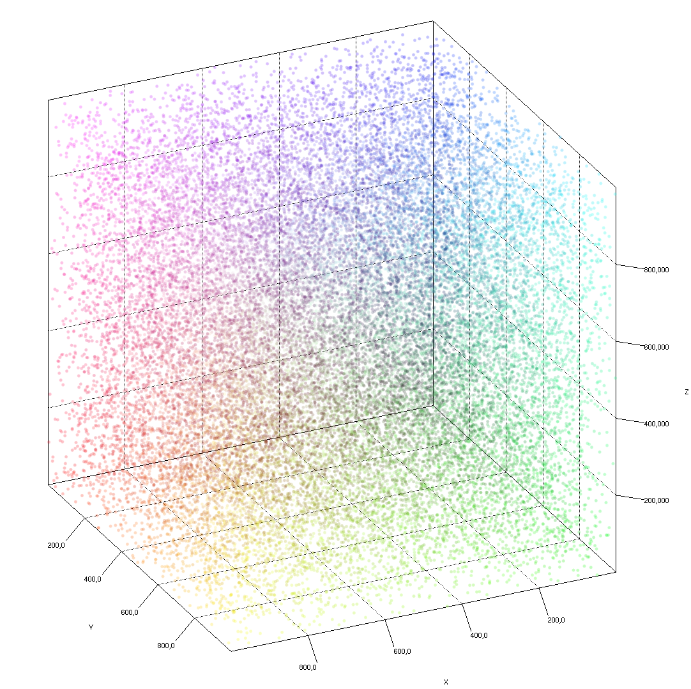

# Pzy3d - 3d charts for Python

Build [Jzy3d](http://www.jzy3d.org) charts for Python.

Jzy3d is a java library, hence calling it from Python might be done by several manners :
* Py4j binding : python initialize a Java Virtual Machine acting like a server. Python scripts then exchange informations with this server. See ```src/main/python/py4j-*.py```
* Jython : your python program is interpreted inside a JVM. Your program can use Java objects. See ```src/main/jython/jython-*.py```

## Using Py4j

Py4j allows calling a Java Virtual Machine from Python. Py4j can call java methods and access java instance references.

### Install using Pip

```
pip install pyzy3d
```

### Run

```python
from pyzy3d.pyzy3d import Pyzy3d
from pyzy3d.generator import Generator

pz = Pyzy3d()

# Generate data
n = 10000
coords = pz.new_coords(n)
Generator().scatter(coords, n)


# Drawable scatter
scatter = pz.new_scatter(coords)
scatter.setWidth(5.0)


# Chart
chart = pz.chart(0)
chart.getQuality().setSmoothPoint(True);
chart.add(scatter)
chart.open("Pyzy3d - Scatter", 800, 600)

pz.shutdown()
```

Will prompt



Console should show it started Py4j Gateway and connected successfully as follow:

```
Will start Pyzy3d Gateway : /Users/martin/Dev/jzy3d/public/pyzy3d/src/main/python/pyzy3d/bin/pyzy3d-1.0.1-SNAPSHOT.jar
Pyzy3d gateway invoked : /Users/martin/Dev/jzy3d/public/pyzy3d/src/main/python/pyzy3d/bin/pyzy3d-1.0.1-SNAPSHOT.jar
Joining Pyzy3d gateway ...
Pyzy3d gateway joined
```

and then show a scatter plot:
* Start a JVM using Pzy3d Jar file located in bin/
* Initialize a java [Coord3ds](https://github.com/jzy3d/jzy3d-api/blob/master/jzy3d-api/src/api/org/jzy3d/maths/Coord3ds.java) to provide a java point cloud Reference
* Set coordinates and colors from python
* Open a Jzy3d chart


### Run example plots

```
cd src/main/python # go to source folder if you are developing pyzy3d

python examples/example_scatter.py
python examples/example_surface.py

```

Surface example is interesting since it shows a way to define a <i>function</i> to render by the JVM gateway.


It will produce the below chart:


Surface example is based on pyzy3d default ```Func3d```
```python
from numpy import *

class Func3d(object):
    def __init__(self, monitor=False):
        self.k = 0
        self.doMonitor = monitor

    def f(self, x, y):
        self.monitor()
        return cos(x) + sin(y)

    def monitor(self):
        ...

    class Java:
        implements = ['org.pyzy3d.PyFunc3d']
```

Last line state that Func3d implements the <a href="https://github.com/jzy3d/pyzy3d/blob/master/src/main/java/org/pyzy3d/PyFunc3d.java">PyFunc3d java interface</a>. Overriding Func3d.f(x,y) let the JVM ask to python which Z value should be generated for a given {X,Y} pair.

#### TODO

* shutdown callback server when caller as finished processing
* detect if gateway is up or no to guess if it should be started
* flag to state if it should remain up + how to reconnect to callback server


### Help

* Kill a running instance of Py4j JavaGateway
```
lsof -n -i4TCP:25334 | grep LISTEN
```

### Packaging the library

#### Help
* https://python-packaging.readthedocs.io/en/latest/
* https://github.com/urbanairship/mvn-python-packaging/blob/master/pom.xml
* https://docs.python.org/3/distutils/setupscript.html#installing-additional-files
* https://blog.jetbrains.com/pycharm/2017/05/how-to-publish-your-package-on-pypi/

#### Build java gateway
```
mvn clean package
cp target/pyzy3d-1.0.1-SNAPSHOT.jar src/main/python/pyzy3d/bin/
```

#### Build python package
```
cd src/main/python
python setup.py sdist
```

Install pyzy3d with an alias so that updated source do not need re-install

```
pip install -e .
```

otherwise

```
pip install .
```

#### Deploy python package

Now register for test deployement
```
twine register dist/pyzy3d-1.0.1.tar.gz -r testpypi
```
https://testpypi.python.org/pypi/pyzy3d

Now deploy to test
```
twine upload dist/* -r testpypi
```


## Using Jython

### Install Jython

* Mac OS ```brew install jython```
* Other ```google install jython```


### Run example plots

```
./run-jython-scatter.sh
./run-jython-surface.sh
```

### Building Pyzy3d Jar Jython

Compile as follow
```
mvn clean package
cp target/pzy3d-api-1.0.1-SNAPSHOT.jar bin/
```

#### Using Pzy3d with Jython
Jython requires path to be defined as follow ```jython -Dpython.path=bin/pzy3d-api-1.0.1-SNAPSHOT.jar src/main/jython/jython-surface.py```

#### Using Pzy3d with Py4j
Py4j requires gateway to be started with ```java -jar bin/pzy3d-api-1.0.1-SNAPSHOT.jar```. Then run a script like ```python src/main/python/py4j-scatter.py```
